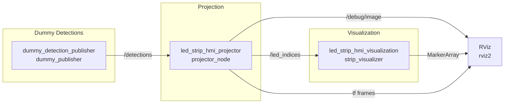

# ws\_led\_strip\_hmi Demo Workspace

Demo workspace for:
* [https://github.com/AIT-Assistive-Autonomous-Systems/led_strip_hmi](https://github.com/AIT-Assistive-Autonomous-Systems/led_strip_hmi)
* [https://github.com/AIT-Assistive-Autonomous-Systems/led_strip_hmi_embedded](https://github.com/AIT-Assistive-Autonomous-Systems/led_strip_hmi_embedded)

## Overview

*ws\_led\_strip\_hmi* is a ROS 2 workspace demonstrating how to map 3D perception data (e.g., human poses or laser scans) onto configurable virtual LED-strip layouts. This enables robots to convey situational awareness via physical LEDs or RViz markers, improving safety and transparency around autonomous platforms.


## Key Components

* **dummy\_detection\_publisher**

  * Publishes mock 3D detections of persons (using poses, bounding boxes) on `/detections` to test downstream nodes.
  * Configurable via `persons.yml` (`src/dummy_detection_publisher/cfg/persons.yml`).

* **led\_strip\_hmi\_msgs**

  * Defines custom ROS 2 messages driving the HMI:

    * `LEDStrip.msg`, `LEDStripConfig.msg`, `LEDStripEffect.msg`
    * Projection info types (`LEDStripProjectionInfo.msg`, `VirtualLEDStripSegment.msg`, etc.)

* **led\_strip\_hmi\_common**

  * Shared utilities for parsing YAML configs, handling coordinate transforms, and modeling virtual LED strips:

    * `config_utils.py`, `config.py` – YAML parsing & validation
    * `tf_utils.py` – helper functions for TF transforms
    * `virtual_strip.py` – abstraction of LED positions, densities, and indexing

* **led\_strip\_hmi\_visualization**

  * `strip_visualizer` node publishes `MarkerArray` to RViz, rendering static LED outlines and dynamic highlights.
  * Configurable via `src/led_strip_hmi_visualization/config/strips.yaml`.

* **led\_strip\_hmi\_projector**

  * `projector_node` subscribes to `/detections` or sensor topics (e.g., `/scan`) and computes which LEDs should light up.
  * Publishes normalized LED indices on `/led_indices` and a debug image on `/debug/image`.
  * Utilizes `drawing.py` and adapter modules to simulate projection onto real surfaces.

## Architecture Overview




## Prerequisites

* **ROS 2** (Humble Hawksbill or later)
* **Python 3.8+** with dependencies: PyYAML, numpy, opencv-python
* **vcstool** for managing repos
* **Docker** & **VS Code Remote - Containers** (optional, for reproducible dev env)
* **X11 forwarding** or local display for RViz GUI

## Setup & Build

```bash
# Clone & initialize
git clone https://github.com/AIT-Assistive-Autonomous-Systems/led_strip_hmi_demo_workspace.git
cd led_strip_hmi_demo_workspace
vcs import src/ < src/ros2.repos
```

**=> Re-open in VSCode devcontainer**

```bash
# In container:
# Install dependencies
rosdep update
rosdep install --from-paths src --ignore-src -r -y

# Build the workspace
./build.sh
# or 
# Ctrl+Shift+B

# Source the overlay
source install/setup.bash
```

## Running the Demos

Launch one of the provided scenarios:

| Demo          | Launch File                                                | Config File      | Description                                                  |
| ------------- | ---------------------------------------------------------- | ---------------- | ------------------------------------------------------------ |
| **A200**      | `ros2 launch led_strip_hmi_demos a200.launch.py`           | `a200.yaml`      | Clearpath Husky A200 robot simulation                        |
| **Caripu**    | `ros2 launch led_strip_hmi_demos complex_strip.launch.py`  | `robot.yaml`     | Mock-person detections + RViz viz + projector on robot model |
| **LaserScan** | `ros2 launch led_strip_hmi_demos laserscan.launch.py`      | `laserscan.yaml` | Projects live or recorded LaserScan data                     |

Running e.g., the Husky A200 demo, you should see a person passing by the robot. The Husky is equipped with LEDs to signal that the robot "sees" the human and indicates this by lighting them up in the direction of perception.


## Example Configuration Files

* **LED strips**: 
  * Defines strip polygons, number of LEDs, frames, ordering, and perception parameters.
  
  `src/led_strip_hmi_demos/config/a200.yaml` 

  `src/led_strip_hmi_demos/config/complex_strip.yaml`


* **Persons**:   
  * Specifies start/end points, velocities, and dimensions for each dummy person.

  `src/dummy_detection_publisher/cfg/persons.yml`


Feel free to edit these YAMLs to test new layouts or detection scenarios.

## Testing

Run all unit & integration tests:

```bash
./test.sh
```

Or test a single package:

```bash
./test_single_pkg.sh <package_name>
```

## Contributing

Contributions are welcome! Please:

1. Fork the repo and create a feature branch
2. Follow code style (flake8, black, pep257)
3. Write tests for new functionality
4. Submit a merge request with clear description

## License

This project is licensed under the Apache License 2.0. See [LICENSE](LICENSE) for details.
